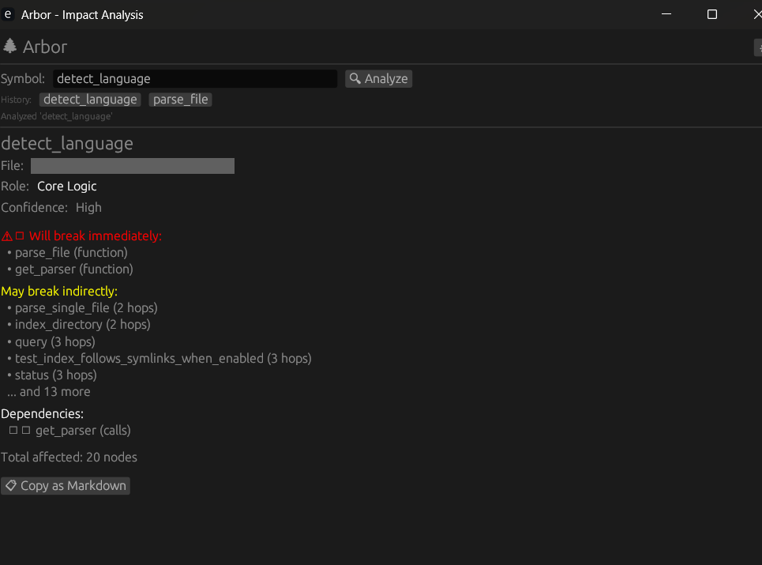

<p align="center">
  
</p>

<h1 align="center">Arbor v1.4.0</h1>

<p align="center">
  <strong>The Graph-Native Intelligence Layer for Code</strong><br>
  <em>Know what breaks before you break it.</em>
</p>

<p align="center">
  <a href="#quick-start">Quick Start</a> •
  <a href="#gui">GUI</a> •
  <a href="#features">Features</a> •
  <a href="#the-unified-nervous-system">Architecture</a> •
  <a href="docs/PROTOCOL.md">Protocol</a> •
  <a href="CONTRIBUTING.md">Contributing</a>
</p>

<p align="center">
  <a href="https://github.com/Anandb71/arbor/actions"></a>
  
  
  
  
  
  <a href="https://glama.ai/mcp/servers/Anandb71/arbor"></a>
</p>

---

> **About to change code but afraid of breaking things?**

```bash
$ arbor refactor detect_language

🔍 Analyzing detect_language

🟢  Confidence: High | Role: Core Logic
   • 15 callers, 3 dependencies
   • Well-connected with manageable impact

⚠️  18 nodes affected (4 direct, 14 transitive)

Will break immediately:
  • parse_file (function)
  • get_parser (function)

→ Proceed carefully. Test affected callers.
```

That's it. One command. Know what breaks before you break it.

---

## GUI

Arbor now includes a native graphical interface for impact analysis:

```bash
arbor gui
```



**Features:**
- 🔍 **Symbol Search**: Enter any function, class, or method name
- 📊 **Impact Display**: See direct callers, indirect callers, and dependencies
- 🔒 **Privacy Spoilers**: File paths hidden by default (click to reveal)
- 🌙 **Dark/Light Mode**: Toggle with one click
- 📋 **Copy as Markdown**: Export analysis for PR descriptions
- 📜 **Search History**: Quick access to recent searches

> CLI and GUI share the same engine — identical analysis across both.

---

## Quick Start

```bash
# Install
cargo install arbor-graph-cli arbor-gui

# Run on any project
cd your-project
arbor refactor <function-name>

# Or use the GUI
arbor gui
```

> 📖 **More commands?** See the [5-minute Quickstart Guide](docs/QUICKSTART.md)

---

## Why Arbor?

Most AI coding assistants treat your codebase like a bag of text. They embed chunks into vectors and hope similarity search finds the right context.

**Arbor builds a graph.** Every function, class, and import is a node. Every call and dependency is an edge. When you ask "what breaks if I change this?", Arbor traces the actual call graph — not keyword matches.

```text
Traditional RAG:         Arbor:
                         
"auth" → 47 results      "auth" → AuthController
                                  ├── validates via → TokenMiddleware  
                                  ├── queries → UserRepository
                                  └── emits → AuthEvent
```

## Build from Source

```bash
# Clone and build
git clone https://github.com/Anandb71/arbor.git
cd arbor/crates
cargo build --release

### System Dependencies (Linux)

If building the GUI on Linux, you'll need the following development headers:

```bash
sudo apt-get install -y pkg-config libx11-dev libxcb-shape0-dev libxcb-xfixes0-dev \
    libxkbcommon-dev libgtk-3-dev libfontconfig1-dev libasound2-dev libssl-dev cmake
```

# Build visualizer (requires Flutter)
cd ../visualizer
flutter build windows
```

That's it. Your IDE or AI agent can now connect to `ws://localhost:7433` and query the graph, or use the MCP protocol over stdio.

## Features

### 🖥️ Native GUI (NEW in v1.4)

A lightweight, egui-based interface for quick impact analysis:
- Enter a symbol name, see what breaks
- Privacy-first: file paths hidden behind spoilers
- Copy results as Markdown for PR descriptions

### 🔮 Confidence Scoring (NEW in v1.4)

Every analysis now includes explainable confidence:

| Level | Indicator | Meaning |
|-------|-----------|---------|
| 🟢 High | Green | Clear edges, well-connected |
| 🟡 Medium | Yellow | Some uncertainty exists |
| 🔴 Low | Red | Potential dynamic calls or isolation |

### 🏷️ Node Roles (NEW in v1.4)

Arbor classifies nodes by their structural role:
- **Entry Point**: No internal callers (API endpoints, main functions)
- **Utility**: Helper functions called by many
- **Core Logic**: Central to the domain
- **Adapter**: Bridges between layers
- **Isolated**: No detected connections

### 🧠 ArborQL & AI Bridge (MCP)

Arbor enables Claude and other LLMs to "walk" your code graph. Using the Model Context Protocol (MCP), agents can run:

- `find_path(start, end)`: Discover the logic flow between two distant components (A* algorithm).
- `analyze_impact(node)`: Determine the blast radius of a change before it happens.
- `get_context(node)`: Retrieve semantically relevant code, not just keyword matches.

### 🔗 World Edges (Cross-File Resolution)

Arbor understands that code doesn't live in isolation. It resolves **imports**, **calls**, and **inheritances** across file boundaries using a Global Symbol Table.

**Concrete example:** When you import `User` in `profile.ts`, Arbor knows it's the same `User` class defined in `auth.ts`. If you rename `User.email` → `User.emailAddress`, Arbor can tell you which 7 files in `services/` will break — before you run the tests.

### 💾 Incremental Persistence

Powered by **Sled**, Arbor's graph persistence layer is atomicity-compliant and lightning fast.

- **Granular Updates**: Only "dirty" nodes are re-written to disk. Saving a file in a 100k LOC repo triggers minimal I/O.
- **Instant Load**: The graph state loads instantly on startup, no re-indexing required.

### 🌲 Logic Forest Visualizer (Debugging & Trust)

The visualizer exists to make AI reasoning **inspectable**. Every node an LLM touches can be seen, traced, and verified by a human.

- **Force-Directed Graph**: 100k+ nodes with Barnes-Hut QuadTree optimization
- **AI Spotlight**: Camera follows the node an AI agent is currently examining
- **Impact Highlights**: See which nodes "vibrate" when you preview a change
- **Interactive**: Drag nodes, hover for details, filter by file/type


### ⚡ Performance

- **Sub-100ms Incremental Sync**: Parsing happens in milliseconds.
- **Binary Serialization**: Graph state uses efficient `bincode` encoding.
- **Rust Core**: Built on the safety and speed of Rust.

## Supported Languages

| Language   | Status | Parser Entity Coverage |
|------------|--------|------------------------|
| **Rust**       | ✅     | Functions, Structs, Impls, Traits, Macros |
| **TypeScript** | ✅     | Classes, Interfaces, Types, Imports, JSX |
| **JavaScript** | ✅     | Functions, Classes, Vars, Imports |
| **Python**     | ✅     | Classes, Functions, Imports, Decorators |
| **Go**         | ✅     | Structs, Interfaces, Funcs, Methods |
| **Java**       | ✅     | Classes, Interfaces, Methods, Fields, Connectors |
| **C**          | ✅     | Structs, Functions, Enums, Typedefs |
| **C++**        | ✅     | Classes, Namespaces, Templates, Impls |
| **C#**         | ✅     | Classes, Methods, Properties, Interfaces, Structs |
| **Dart**       | ✅     | Classes, Mixins, Methods, Widgets |

## Platform Support

| Platform | CLI | GUI | Visualizer |
|----------|-----|-----|------------|
| **Windows** | ✅ | ✅ | ✅ |
| **macOS** | ✅ | ✅ | ✅ |
| **Linux** | ✅ | ✅ | ✅ |

### Monorepo & Symlink Support

For monorepos using `pnpm`, `npm link`, or symlinked local packages:

```bash
arbor index --follow-symlinks
arbor viz --follow-symlinks
arbor bridge --follow-symlinks
```

This ensures symlinked dependencies are indexed instead of skipped.

## Project Structure

```
arbor/
├── crates/                 # Rust workspace
│   ├── arbor-core/         # AST parsing, Tree-sitter integration
│   ├── arbor-graph/        # Graph schema, Sled Store, Symbol Table
│   ├── arbor-watcher/      # File watching, incremental sync
│   ├── arbor-server/       # WebSocket server, protocol handler
│   ├── arbor-mcp/          # Model Context Protocol bridge
│   ├── arbor-cli/          # Command-line interface (pkg: arbor-graph-cli)
│   └── arbor-gui/          # Native GUI (egui-based) ← NEW
├── visualizer/             # Flutter desktop app
│   ├── lib/
│   │   ├── core/           # Theme, state management
│   │   ├── graph/          # Force-directed layout, LOD logic
│   │   └── shaders/        # GLSL bloom/glow effects
│   └── shaders/            # Raw GLSL files
└── docs/                   # Extended documentation
```

## CLI Commands

| Command | Description |
|---------|-------------|
| `arbor init` | Creates `.arbor/` config directory |
| `arbor index` | Full index of the codebase |
| `arbor query <q>` | Search the graph |
| `arbor serve` | Start the sidecar server |
| `arbor export` | Export graph to JSON |
| `arbor status` | Show index status |
| `arbor status --files` | List all indexed files |
| `arbor viz` | Launch the Logic Forest visualizer |
| `arbor bridge` | Start MCP server for AI integration |
| `arbor bridge --viz` | MCP + Visualizer together |
| `arbor check-health` | System diagnostics and health check |
| ⭐ `arbor refactor` | Safe refactor with blast radius preview |
| ⭐ `arbor explain` | Graph-backed code explanation |
| 🆕 `arbor gui` | Launch the native GUI |
| 🆕 `arbor pr-summary` | Generate PR impact summary |
| 🆕 `arbor watch` | Auto-refresh index on file changes |

## Roadmap

### v1.0.0 – v1.3.0 (Completed)

- [x] Core indexer and CLI
- [x] Logic Forest visualizer (LOD, Bloom)
- [x] VS Code extension
- [x] Agentic Bridge (MCP)
- [x] Multi-language parsers (Rust, TS, Python, Go, Java, C/C++, C#, Dart)
- [x] Impact Radius Simulator
- [x] Context-Aware Edge Resolution
- [x] Persistent Caching

### v1.4.0 "The Trust Update" ✅ (Current)

> **See the impact. Trust the output.**

- [x] **Native GUI**: Egui-based impact analysis interface
- [x] **Confidence Scoring**: Explainable Low/Medium/High risk levels
- [x] **Node Roles**: Entry Point, Utility, Core Logic, Adapter, Isolated
- [x] **Privacy Spoilers**: File paths hidden until clicked
- [x] **PR Summary Generator**: `arbor pr-summary`
- [x] **Watch Mode**: `arbor watch` for auto-refresh

📖 **Full roadmap**: [docs/ROADMAP.md](docs/ROADMAP.md)

## Troubleshooting

### Why does impact analysis return 0 nodes?

- The target node may not exist in the graph. Run `arbor query "NodeName"` to verify.
- The node may have no dependents (nothing calls or imports it).
- Try increasing depth: `arbor refactor NodeName --depth 5`.

### Why do Flutter widgets behave differently?

- Flutter uses composition, not inheritance. Arbor tracks `contains` edges, not class hierarchies.
- Use `arbor refactor WidgetName --depth 2` to see nested widgets.

### When to use --follow-symlinks?

- In monorepos with linked packages (pnpm, npm link).
- When local dependencies are symlinked into `node_modules`.
- Default is OFF to avoid infinite loops from circular links.

### Graph is empty after indexing?

- Check that your files use supported extensions: `.rs`, `.ts`, `.tsx`, `.py`, `.dart`, `.go`.
- Ensure files are not excluded by `.gitignore`.
- Run `arbor status` to see which extensions were detected.

## Security

Arbor is designed with a **Local-First** security model:

- **No data exfiltration**: All indexing and querying happens 100% locally. No code leaves your machine.
- **No API keys required**: Works entirely offline.
- **No telemetry**: Zero phone-home behavior.
- **Open source**: Full source code available for audit.

## Who Arbor Is For

**Arbor is for:**

- Large or long-lived codebases
- AI-assisted refactoring where correctness matters
- Engineers who value precision over convenience

**Arbor is not for:**

- Small scripts or throwaway code
- Prompt-only workflows without code context
- People who just want autocomplete

## The Unified Nervous System

Arbor represents the complete "Nervous System" for your code:

```
     Claude asks about AuthController
           │
           ▼
    ┌─────────────────┐
    │   Arbor Bridge  │  ← MCP Server (ArborQL)
    │   (arbor-mcp)   │     "find_path(Auth, DB)"
    └────────┬────────┘
             │ trigger_spotlight()
             ▼
    ┌─────────────────┐
    │   SyncServer    │  ← WebSocket broadcast
    │   (port 8080)   │
    └────────┬────────┘
             │ FocusNode message
     ┌───────┴───────┐
     │               │
     ▼               ▼
┌─────────┐    ┌─────────┐
│ VS Code │    │  Forest │
│ Golden  │    │ Camera  │
│Highlight│    │Animation│
│ #FFD700 │    │ 600ms   │
└─────────┘    └─────────┘
```

## License

MIT — use it however you want. See [LICENSE](LICENSE) for details.

---

<p align="center">
  <strong>Built for developers who think code is more than text.</strong>
</p>

<p align="center">
  <em>"The forest is mapped. The AI is walking the path."</em>
</p>

<p align="center">
  <a href="https://github.com/Anandb71/arbor">⭐ Star us on GitHub</a>
</p>
